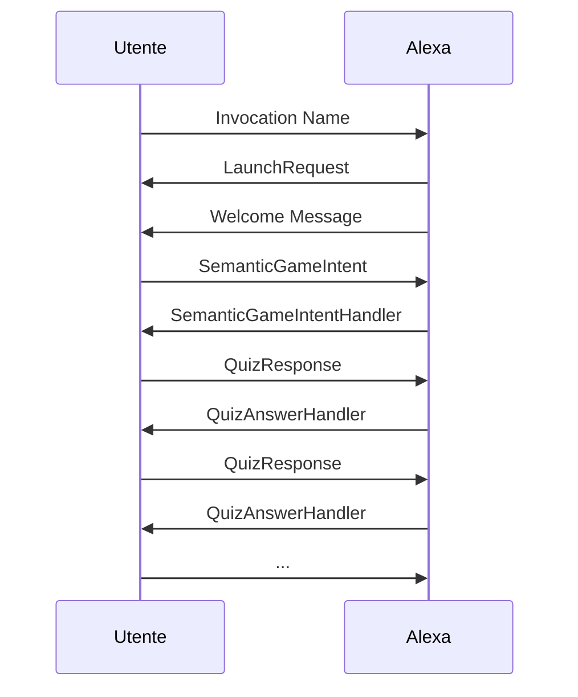
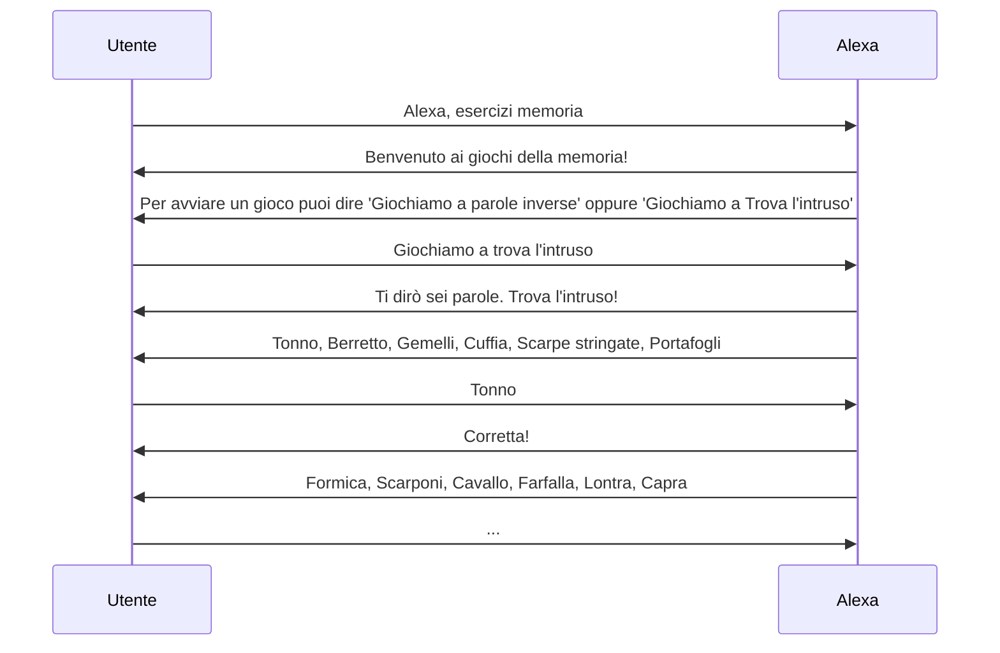

# Esercizi memoria
  

Esercizi memoria è una skill sviluppata per Alexa in grado di aiutare i pazienti affetti da Alzheimer ad allenare costantemente la loro memoria attraverso dei mini giochi.


# Skill

Per avviare la skill è necessario dire: "Alexa, esercizi memoria"

## Giochi

Al momento sono presenti soltanto due giochi, ma grazie alla logica con cui è stato sviluppato è possibile espandere sia il dataset di domande, sia di nuovi giochi. 

### Quiz inverso

Questo gioco consiste nell'inibire la risposta corretta e dare quella errata.
Prendendo spunto dal gioco televisivo di Canale 5 “Avanti un altro”, sia pensato ad un esercizio analogo al gioco finale della trasmissione, in cui vengono poste delle domande di cultura generale con due possibili risposte. 
Una delle due risposte è esatta e l’altra errata, lo scopo è di dare la risposta errata, inibendo quella corretta.  
Come nel gioco televisivo, si strutturano delle batterie di domande (più o meno lunghe) e l’obiettivo è fornire la riposta errata a tutte le domande. Ad ogni errore si riinizia dalla prima domanda.

Il timer per ogni risposta non è stato impostato per delle difficoltà tecniche, ad esempio: 

 -  L'utente non sa quanto tempo manca;
 - Può succedere che Alexa comunichi che il tempo si è esaurito mentre il paziente sta pronunciando la sua risposta;  

### Trova l'intruso

L'esercizio di questa skill consiste nel trovare l’elemento non congruente con gli altri.
Vengono presentati una lista di ingredienti affini (verdure) con un elemento che non fa parte della stessa categoria (pesce), che va quindi individuato.  
Ad esempio:
	**Alexa**: “farro, fagioli, piselli, lenticchie, sgombro”;
	 **Utente**: “sgombro”;
	 **Alexa**: "Corretta!"
	 
Può essere condotto con varie categorie di stimoli, come Paesi, città, veicoli, numeri, lettere, oggetti...

## Alexa Developer Console

La skill è stata scritta in Python e caricata su [Alexa Developer Console](https://developer.amazon.com/alexa/console/ask).

```
../
    ask-resources.json
    lambda/
       data.py
       lambda_function.py
       utils.py
       requirements.txt
     skill-package/
           interactionModels/
	           custom/
		           it-IT.json
           skill.json
```

## Import skill

### Build 
Per importare il model bisogna andare su "Interaction Model -> JSON Editor" e fare drag & drop del file [it-IT.json](skill-package/interactionModels/custom/it-IT.json)

E' molto importate effettuare "**Save Model**" e "**Build Model**".
		
### Code
Per importare la skill è necessario andare su Code --> Import Code. 
Selezionare e caricare la cartella **lamba**. 

### Test 

E' possibile effettuare dei test per verificare che tutti gli import siano stati correttamente eseguiti.

## Codice

### Data

Tutto il codice è stato sviluppato per renderlo scalabile ed adattabile.
Infatti sono presenti delle variabili globali che vanno a regolare le opzioni del gioco. 

Ad esempio: 

    MAX_CORRECT_OBJ = 5 #Numero massimo di oggetti corretti nella lista
    MAX_WRONG_OBJ = 1 #Numero massimo di oggetti sbagliati nella lista
    MAX_QUIZ = 5 #Numero massimo di domande per trova l'intruso
    MAX_SEMANTIC_CATEGORY = 2 #Numero massimo di categorie possibili
    SEMANTIC_LIST_CATEGORY = [1, 2] # ID categorie presenti in SEMANTIC_LIST
    
    MAX_QUESTIONS = 10 #Numero max di domande per quiz inverso (avanti un altro)

#### QuestionList

Contiene tutte le domande e risposte del gioco Quiz Inverso. 
Per aggiungere o modificare le domande basta inserirle nell'oggetto QUESTION_LIST.

|         id       |question                          |correct                         | wrong |
|----------------|-------------------------------|-----------------------------|---|
|`1`|`Zenga o Veltroni, è stato portiere dell'Inter?`|`Veltroni`|`Zenga`|
|`2`|`Crick o Crack può essere finanziario un...?`|`Crick`|`Crack`|
|`3`|`Riso o patete, i supplì sono le crocchette sono di...?`|`Patate`| `Riso` |

#### SemanticList
Contiente la lista di tutti gli oggetti appartenenti ad una categoria semantica del gioco Trova l'Intruso.
Per aggiungere o modificare la lista basta inserirle nell'oggetto SEMANTIC_LIST.
|         category       |id                          |name                         | 
|----------------|-------------------------------|-----------------------------|
|1|1|`Canottiera`
|1|6|`T-shirt`
|2|81|`Fenicottero`|

##### category:

id | name
|---|---|
|1|Abbigliamento|
|2| Animali

## Utils
In utils troviamo i metodi per la generazione delle domande dei quiz.
### get_random_list_question

    def get_random_list_question():
    return random.sample(data.QUESTION_LIST, data.MAX_QUESTIONS)
### create_semantic_list
Con questa funzione andiamo a prendere n oggetti senza ripetizioni dall'oggetto QUESTION LIST. 

    def create_semantic_list():

    str = ""
    # PRENDO 2 ELEMENTI DALLA LISTA DELLE CATEGORIE
    sematic_category = random.sample(data.SEMANTIC_LIST_CATEGORY, data.MAX_SEMANTIC_CATEGORY)

    # PRENDO TUTTI GLI ELEMENTI DI UNA CATEGORIA e li seleziono
    correct_list = random.sample(get_semantic_list(sematic_category[0]), data.MAX_CORRECT_OBJ)
    wrong_value = random.sample(get_semantic_list(sematic_category[1]), data.MAX_WRONG_OBJ)

    # MESCOLO ULTERIORMENTE GLI ELEMENTI
    list = random.sample(correct_list + wrong_value,data.MAX_CORRECT_OBJ + data.MAX_WRONG_OBJ)
    
    # Converto in strigna l'array 
    for i, _ in enumerate(list):
        str += _
        if i < len(list) - 1:
            str += ", " # separo i valori con virgola tranne l'ultimo
    return list, wrong_value

Con questa funzione ci andiamo a creare una lista lunga n, con all'interno n oggetti corretti.
Esempio: 

    "semantic_list": [
				[
					"Tonno",
					"Berretto",
					"Gemelli",
					"Cuffia",
					"Scarpe stringate",
					"Portafogli"
				],
				[
					"Formica",
					"Scarponi",
					"Cavallo",
					"Farfalla",
					"Lontra",
					"Capra"
				],
				[
					"Gonna",
					"Costume da bagno uomo",
					...
				]
			]
## lambda_function
 Lambda_function gestisce tutta la comunicazione tra l'utente ed Alexa. 
 Quando un utente chiede di giocare ad un gioco, viene richiamato il suo handler associato all'intent richiesto dall'utente. 

### AvantiUnAltroIntentHandler

    class AvantiUnAltroIntentHandler(AbstractRequestHandler):
    """Handler for Hello World Intent."""

    def can_handle(self, handler_input):
        # type: (HandlerInput) -> bool
        return ask_utils.is_intent_name("AvantiUnAltroIntent")(handler_input)

    def handle(self, handler_input):
        # type: (HandlerInput) -> Respons

        # logger.info("Avanti un altro Handler")
        session_attr = handler_input.attributes_manager.session_attributes
        session_attr["counter"] = 0
        session_attr["game_type"] = 0
        session_attr['questions'] = []
        session_attr['questions'] = utils.get_random_list_question()

        speak_output = str(data.START_1_GAME) + str(session_attr['questions'][session_attr['counter']]['question'])
        return (
            handler_input.response_builder
                .speak(speak_output)
                .ask(speak_output)
                .response
        )

Vengono utilizzati i `session_attr` per salvarsi il tipo di gioco richiesto dall'utente, le domande da chiedergli e il suo punteggio. 

### SemanticGameIntentHandler

    class SemanticGameIntentHandler(AbstractRequestHandler):
    def can_handle(self, handler_input):
        # type: (HandlerInput) -> bool
        return ask_utils.is_intent_name("SemanticGameIntent")(handler_input)

    def handle(self, handler_input):
        # type: (HandlerInput) -> Respons
        session_attr = handler_input.attributes_manager.session_attributes
        session_attr['game_type'] = 1
        session_attr['counter'] = 0
        session_attr['score'] = 0
        session_attr['semantic_list'] = []
        session_attr['wrong_list'] = []
        quiz_list = []
        wrong_list = []
        i = 0
        while i <= data.MAX_QUIZ:
            _, __ = utils.create_semantic_list()
            quiz_list.append(_)
            wrong_list.append(__[0])
            i += 1
        session_attr['semantic_list'] = quiz_list
        session_attr['wrong_list'] = wrong_list

        speak_output = str(data.START_2_GAME)  # Leggo info sul gioco

        for i, _ in enumerate(session_attr['semantic_list'][session_attr['counter']]):
            speak_output += _
            if i < len(session_attr['semantic_list'][session_attr['counter']]) - 1:
                speak_output += ", "
        return (
            handler_input.response_builder
                .speak(str(speak_output))
                .ask(str(speak_output))
                .response
        )
 
 ### QuizAnswerHandler

Questo handler si occupa di tutta la comunicazione durante un gioco. 
Si parte con la lettura del `session_attr['game_type']` precedentemente impostato, e si continua con la logica del gioco. 
Se ad esempio l'utente ha richiesto il gioco 0, ovvero avanti un altro, ci andremo a leggere la risposta corretta da 

    session_attr['questions'][session_attr['counter']]['correct']
 e lo andremo a confrontare con la risposta dell'utente
 

     ask_utils.request_util.get_slot(handler_input, "response")

Se la risposta data dall'utente è corretta andremo ad impostare `session_attr["counter"] += 1` così da far leggere ad Alexa la domanda successiva, altrimenti `session_attr["counter"] = 0` per ricominciare il gioco.

    if session_attr['game_type'] == 0:
            correct_answer = str(session_attr['questions'][session_attr['counter']]['correct']).lower()
            slot = ask_utils.request_util.get_slot(handler_input, "response")
            if slot.value:
                answer = str(slot.value).lower()
            else:
                answer = "boh"

            if answer == correct_answer:
                session_attr["counter"] += 1
                if session_attr['counter'] >= data.MAX_QUESTIONS:
                    speak = data.EXIT_SUCCESS_SKILL_MESSAGE + data.PLAY_AGAIN
                    session_attr['game_type'] = -1
                    return handler_input.response_builder.speak(speak).ask(speak).response
            else:
                session_attr["counter"] = 0

            return handler_input.response_builder.speak(
                session_attr['questions'][session_attr["counter"]]['question']).ask(
                session_attr['questions'][session_attr["counter"]]['question']).response

Invece se il gioco richiesto dall'utente è trova l'intruso, andremo a verificare che `session_attr['game_type']`  è uguale ad 1, leggerci la risposta corretta del quiz e la risposta data dall'utente per poi confrontarle. 

     if answer == correct_answer:
                session_attr['score'] += 1
                session_attr['counter'] += 1
                speak = "Corretta! "
            else:
                session_attr['counter'] += 1
                speak = "Sbagliata! "

In questo game è presente anche un punteggio che gli viene attribuito, se la risposta è corretta +1, altrimenti viene letta la domanda successiva. 

Alla fine del game, all'utente gli viene comunicato il suo punteggio: 

    if session_attr['counter'] >= data.MAX_QUIZ:
                session_attr['game_type'] = -1
                speak += "Hai risposto correttamente a " + str(session_attr['score']) + " su " + str(data.MAX_QUIZ)
                speak += data.PLAY_AGAIN

## UML 


###  Interazione per intenti

###  Interazione dialoghi


